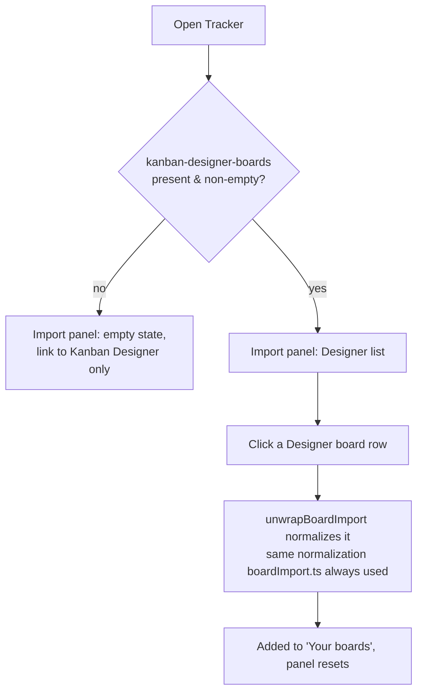

# localstorage-board-import — UX Design

ACs covered: AC1, AC2, AC3, AC4, AC5, AC6, AC7 (all — this is UI-surface only, AC2/AC5/AC6 are behavior already satisfied by reusing `unwrapBoardImport()`, not new UI).

## Where this lives

`ImportPanel.tsx`, rendered from `BoardHome.tsx` — the same single-panel
`.card` shown today (no separate screen/route). The panel already ends
with a "design a board first?" hint linking out to Kanban Designer
(`import.designHint` / `import.designLink`, lines 79-87) — this feature
makes that relationship active instead of just a link.

**Superseded by UAT decision (2026-09-04): JSON file/paste import is
removed, not demoted.** The progressive-disclosure design below (a
collapsible "Other ways to import" section) is **no longer the plan** —
recorded here struck through for the record, replaced by the simpler
design in the next section.

~~When `kanban-designer-boards` has entries → the Designer list renders
first, expanded; the existing upload/paste UI moves below a disclosure
toggle ("Other ways to import ▾"), collapsed by default. When absent →
today's upload/paste panel, unchanged.~~

## Revised: no more file/paste UI at all

The panel now has exactly two states, and no disclosure/toggle:

- **Designer boards present** → the picker list, full stop. No
  upload button, no paste textarea, no toggle to reveal them (they no
  longer exist).
- **Designer boards absent/empty** (AC8, new) → an explanatory empty
  state: icon + one line ("No boards yet — design one in Kanban Designer,
  then come back here to track it") + the existing "Open Kanban Designer"
  link, now doing double duty as the *only* way forward from this screen
  in the common case. This is a real behavior change from today (today's
  panel always has file/paste to fall back to) — worth calling out plainly
  rather than treating as a trivial simplification: a user with no
  Designer boards and no share link literally cannot get a board into
  Tracker from this screen. That's the accepted tradeoff per the UAT
  decision, not an oversight.

This keeps the common case (Designer + Tracker used together, same
browser) to one click, and removes the fallback along with the manual-JSON
UI, exactly as decided.

**Resolves the other open question** ("disambiguate same-named boards"):
the meta line already carries a relative-updated timestamp (see wireframe),
so two boards named "Sprint Board" are told apart by "updated 2h ago" vs
"updated 3d ago" without extra UI. If two boards somehow share both name
and exact timestamp, that's a pre-existing Designer-side ambiguity, not
something Tracker's picker needs to solve.

## Wireframe — Designer boards present

```
┌─────────────────────────────────────────────┐
│ Import a board                               │
│ Bring in a board to start tracking it.       │
│                                               │
│ From Kanban Designer                         │
│ ┌───────────────────────────────────────┐   │
│ │ ▦ Sprint 14 Board            →         │   │
│ │   4 columns · 12 cards · updated 2h ago│   │
│ ├───────────────────────────────────────┤   │
│ │ ▦ Onboarding Flow            →         │   │
│ │   3 columns · 7 cards · updated 3d ago │   │
│ └───────────────────────────────────────┘   │
└─────────────────────────────────────────────┘
```

Each row is a single button (whole row clickable, not just the arrow) —
consistent with `BoardHome`'s existing "Your boards" list pattern
(`onOpen` on the row, not a separate link). Icon is the existing
`KanbanIcon`, same one used for Tracker's own board list, so a Designer
board and an already-imported Tracker board read as "the same kind of
thing" — deliberate, reinforces that this is just another board, not a
foreign object.

## Wireframe — no Designer boards (new empty state, AC8)

```
┌─────────────────────────────────────────────┐
│ Import a board                               │
│                                               │
│                ▦                             │
│         No boards yet                        │
│  Design one in Kanban Designer, then come     │
│  back here to track it.                       │
│                                               │
│      [ Open Kanban Designer ]                │
└─────────────────────────────────────────────┘
```

Replaces both the old "always show upload/paste" default and the panel's
subtitle — with no import mechanism left to introduce ("Bring in a board
to start tracking it" no longer describes anything actionable on this
screen), the empty state itself carries the explanation and the one
available action. Styled like `BoardHome`'s existing zero-boards state
(`KanbanIcon` + heading + subtitle, `home.emptyHeading`/`home.emptySubtitle`
pattern) for visual consistency rather than inventing a second empty-state
style.

## User flow



(A `#board=`/`?prefill=` link still bypasses this panel entirely and
imports on load, same as today — not pictured, unchanged.)

## States Matrix

| State | Designer list | Empty state | Notes |
|---|---|---|---|
| **Empty** (no Designer boards, no Tracker boards) | Hidden | Shown — icon, heading, subtitle, "Open Kanban Designer" link | AC3/AC8 — this is now the *only* content in the panel when boards are absent, not a fallback alongside file/paste |
| **Loading** | N/A | N/A | `localStorage.getItem` is synchronous; no spinner needed |
| **Error** | N/A | N/A | No error state remains in this panel — malformed/wrong-shape entries in `kanban-designer-boards` are silently skipped, not shown as broken rows; there's no more paste/upload input for a user to get wrong |
| **Success** (Designer board picked) | Board appears in "Your boards" above, panel stays mounted | — | No toast in current UX; keep consistent |
| **Retry** (pick the same Designer board again) | Same row, same click, creates a second `TrackerBoard` | — | AC5 — intentional, not blocked |

## Responsive Specifics

Unchanged from the existing panel's breakpoints — it's already a single
`max-w-lg mx-auto` column at all widths (`ImportPanel.tsx` line 37), no
grid to reflow. Designer board rows stack full-width like the existing
paste textarea; no new breakpoint needed. `< 640px` and `≥ 640px` both get
identical single-column layout for this panel (differs from `BoardHome`'s
"Your boards" grid, which does go 1→2 columns at `sm:`, but that's a
separate, unaffected section).

## Accessibility Checklist

- Each Designer board row is a real `<button>` (not a `<div onClick>`),
  matching the existing "Your boards" row pattern in `BoardHome.tsx`.
- Row's accessible name includes the board name and summary, e.g.
  `aria-label` or visible text equivalent to "Import Sprint 14 Board, 4
  columns, 12 cards, updated 2 hours ago" — don't rely on the arrow icon
  alone conveying "import."
- No toggle/disclosure anymore — removed along with the plan it belonged
  to. Nothing to add here for it.
- Focus order: Designer rows in list order (or, in the empty state, the
  single "Open Kanban Designer" link/button) — natural DOM order, no
  `tabindex` tricks needed.
- Color contrast: reuse existing `.card`, `text-gray-*` tokens already
  passing contrast elsewhere in this file — no new colors introduced.
- The existing `import.designHint` link (opens Kanban Designer in a new
  tab) keeps its current `target="_blank" rel="noopener noreferrer"` and
  visible focus state — unchanged.

## Key decisions

- **Revised 2026-09-04 per UAT**: no progressive disclosure, no toggle —
  file/paste UI is gone, so the panel is simply "picker" or "empty state,"
  never both.
- Reuse `KanbanIcon` for Designer board rows (visual continuity with
  Tracker's own board list) rather than introducing a new "Designer" brand
  icon.
- New empty state (AC8) styled after `BoardHome`'s existing zero-boards
  pattern (icon + heading + subtitle) rather than a new visual language.
- No success toast/confirmation — consistent with current import UX,
  which relies on the new board appearing in "Your boards" as the
  confirmation.

## Spec feedback

The disambiguation question (resolved via the existing updatedAt
timestamp) still stands. The file/paste keep-vs-remove question is now
**resolved by the user directly, not by UX**: removed. The one remaining
open spec question (legacy singular-key read) is a data-contract call
outside UX scope — still open for Laznik/Cmok.

States to implement: Designer list (boards present) vs. empty state
(boards absent, AC8) — no toggle, no file/paste states. Row click →
import → success (board appears above).
Key decisions: no progressive disclosure (superseded), reuse `KanbanIcon`,
no toast, empty state matches `BoardHome`'s existing pattern.
Accessibility: real `<button>` rows with full accessible names, natural
DOM focus order, no new color tokens.
