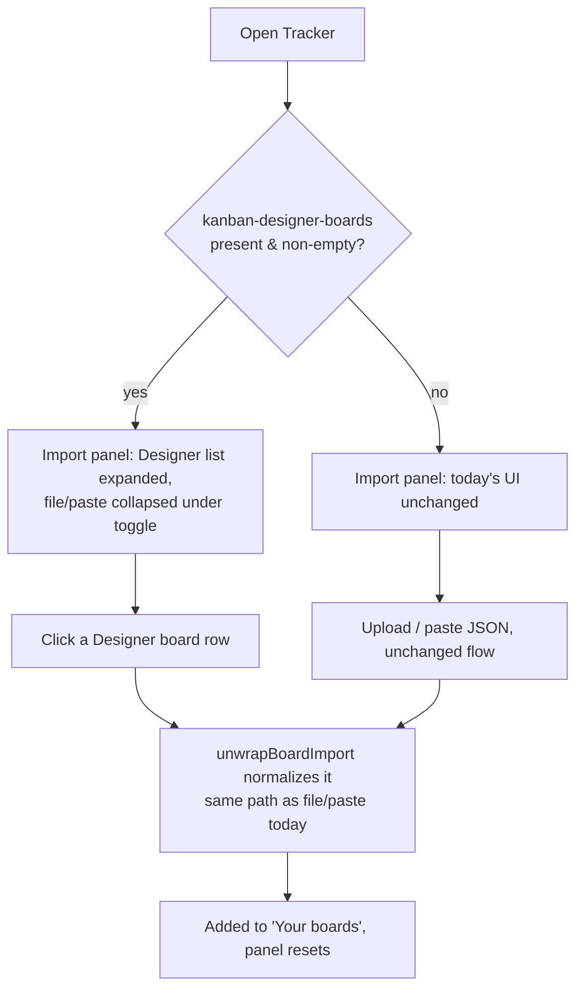

# localstorage-board-import — UX Design

ACs covered: AC1, AC2, AC3, AC4, AC5, AC6, AC7 (all — this is UI-surface only, AC2/AC5/AC6 are behavior already satisfied by reusing `unwrapBoardImport()`, not new UI).

## Where this lives

`ImportPanel.tsx`, rendered from `BoardHome.tsx` — the same single-panel
`.card` shown today (no separate screen/route, no tabs exist in the current
UI, so this is **not** a tab-switch design). The panel already ends with a
"design a board first?" hint linking out to Kanban Designer
(`import.designHint` / `import.designLink`, lines 79-87) — this feature
makes that relationship active instead of just a link.

**Resolves the open question from spec** ("default tab, or secondary?"):
no tabs are introduced. Instead, **progressive disclosure**:
- When `kanban-designer-boards` has entries → the Designer list renders
  **first, expanded**; the existing upload/paste UI moves **below a
  disclosure toggle** ("Other ways to import ▾", collapsed by default).
- When it's absent/empty → the panel looks **exactly like it does today**
  (upload button + paste box, fully visible, no toggle, no empty-state
  message for the picker — nothing to announce, per spec AC3 "never an
  error", extended here to "never a partial/empty widget either").

This keeps the common case (Designer + Tracker used together, same
browser) to one click, without hiding file/paste from anyone who needs it
(the deferred spec decision — kept, not removed).

**Resolves the other open question** ("disambiguate same-named boards"):
the meta line already carries a relative-updated timestamp (see wireframe),
so two boards named "Sprint Board" are told apart by "updated 2h ago" vs
"updated 3d ago" without extra UI. If two boards somehow share both name
and exact timestamp, that's a pre-existing Designer-side ambiguity, not
something Tracker's picker needs to solve.

## Wireframe — Designer boards present

```
┌─────────────────────────────────────────────┐
│ Import a board                               │
│ Bring in a board to start tracking it.       │
│                                               │
│ From Kanban Designer                         │
│ ┌───────────────────────────────────────┐   │
│ │ ▦ Sprint 14 Board            →         │   │
│ │   4 columns · 12 cards · updated 2h ago│   │
│ ├───────────────────────────────────────┤   │
│ │ ▦ Onboarding Flow            →         │   │
│ │   3 columns · 7 cards · updated 3d ago │   │
│ └───────────────────────────────────────┘   │
│                                               │
│ ▾ Other ways to import                       │
│   (collapsed: upload / paste JSON, as today) │
└─────────────────────────────────────────────┘
```

Each row is a single button (whole row clickable, not just the arrow) —
consistent with `BoardHome`'s existing "Your boards" list pattern
(`onOpen` on the row, not a separate link). Icon is the existing
`KanbanIcon`, same one used for Tracker's own board list, so a Designer
board and an already-imported Tracker board read as "the same kind of
thing" — deliberate, reinforces that this is just another board, not a
foreign object.

## Wireframe — no Designer boards (today's layout, unchanged)

```
┌─────────────────────────────────────────────┐
│ Import a board                               │
│ Bring in a board to start tracking it.       │
│                                               │
│ [⇧ Upload JSON file]                         │
│                                               │
│ Paste board JSON                             │
│ ┌───────────────────────────────────────┐   │
│ │                                         │   │
│ └───────────────────────────────────────┘   │
│ [Import from paste]                          │
│                                               │
│ 🔗 Design a board first? Open Kanban Designer│
└─────────────────────────────────────────────┘
```

No Designer section, no toggle — byte-for-byte the current `ImportPanel`.
A user with no Designer boards yet should not see a UI element that has
nothing in it.

## User flow



## States Matrix

| State | Designer list | File/paste section | Notes |
|---|---|---|---|
| **Empty** (no Designer boards, no Tracker boards) | Hidden entirely | Fully visible, expanded (today's behavior) | AC3 |
| **Loading** | N/A | N/A | Both reads are synchronous (`localStorage.getItem` / `FileReader` is near-instant for JSON-sized files); no spinner needed, matches today's no-loading-state UI |
| **Error** (malformed pasted/uploaded JSON) | Unaffected | Existing red `import.error` text, unchanged | Designer list itself has no error state — malformed/wrong-shape entries in `kanban-designer-boards` are silently skipped, not shown as broken rows (AC3 spirit: never surface Designer-side data problems as a Tracker error) |
| **Success** (Designer board picked, or file/paste succeeds) | Panel behavior unchanged: board appears in "Your boards" above, panel stays mounted with its default (collapsed-if-Designer-present) layout | Same | No toast in current UX; keep consistent — don't add one just for this path |
| **Retry** (pick the same Designer board again) | Same row, same click, creates a second `TrackerBoard` | — | AC5 — intentional, not blocked |
| **Populated, toggle closed** (default, Designer boards exist) | Expanded | Collapsed behind "Other ways to import ▾" | New default state |
| **Populated, toggle opened** | Expanded | Expanded (user clicked the disclosure) | Toggle is local `useState`, not persisted — reopens collapsed next visit; matches this panel having no other persisted UI prefs today |

## Responsive Specifics

Unchanged from the existing panel's breakpoints — it's already a single
`max-w-lg mx-auto` column at all widths (`ImportPanel.tsx` line 37), no
grid to reflow. Designer board rows stack full-width like the existing
paste textarea; no new breakpoint needed. `< 640px` and `≥ 640px` both get
identical single-column layout for this panel (differs from `BoardHome`'s
"Your boards" grid, which does go 1→2 columns at `sm:`, but that's a
separate, unaffected section).

## Accessibility Checklist

- Each Designer board row is a real `<button>` (not a `<div onClick>`),
  matching the existing "Your boards" row pattern in `BoardHome.tsx`.
- Row's accessible name includes the board name and summary, e.g.
  `aria-label` or visible text equivalent to "Import Sprint 14 Board, 4
  columns, 12 cards, updated 2 hours ago" — don't rely on the arrow icon
  alone conveying "import."
- The "Other ways to import ▾" toggle is a `<button>` with
  `aria-expanded` reflecting open/closed state, controlling a section with
  a matching `id`/`aria-controls` — standard disclosure pattern already
  usable via native `<details>`/`<summary>` if simpler to implement (no
  animation requirement here, so `<details>` is a legitimate, lower-effort
  choice worth Cmok considering).
- Focus order: Designer rows in list order, then the toggle, then
  upload/paste controls when expanded — natural DOM order, no `tabindex`
  tricks needed.
- Color contrast: reuse existing `.card`, `text-gray-*` tokens already
  passing contrast elsewhere in this file — no new colors introduced.
- The existing `import.designHint` link (opens Kanban Designer in a new
  tab) keeps its current `target="_blank" rel="noopener noreferrer"` and
  visible focus state — unchanged.

## Key decisions

- No tabs — progressive disclosure (Designer list expanded + collapsible
  file/paste) instead, to avoid hiding the fallback path entirely while
  still making the common case one click.
- Reuse `KanbanIcon` for Designer board rows (visual continuity with
  Tracker's own board list) rather than introducing a new "Designer" brand
  icon.
- No new loading or empty-state UI for the picker itself — it's either
  fully absent (nothing to design) or fully populated (synchronous read).
- No success toast/confirmation — consistent with current import UX,
  which relies on the new board appearing in "Your boards" as the
  confirmation.

## Spec feedback

None — the two open questions this UX had authority to resolve (default
tab vs. secondary; disambiguation) are resolved above. The remaining two
open spec questions (full removal of file/paste; whether Tracker should
also read Designer's legacy singular key) are product/data-contract calls
outside UX scope — still open for the user at UAT and for Laznik/Cmok
respectively.

States to implement: Designer list expanded/collapsed via disclosure
toggle, empty (Designer boards absent → panel unchanged from today), row
click → import → success (board appears above), malformed
paste/upload → existing error text.
Key decisions: progressive disclosure (not tabs), reuse `KanbanIcon`,
no toast, `<details>`/`<summary>` viable for the toggle.
Accessibility: real `<button>` rows with full accessible names,
`aria-expanded` on the toggle, natural DOM focus order, no new color
tokens.
